# lane-detection-openCV

```image = cv2.imread('test_image.jpg')``` </br>
- making a copy of image in array rep </br>
```lane_image = np.copy(image)```
# converting the image in to gray sclae for reducing the channels </br>
- gray scale images only has single channel, while RGB has three channesl </br>
```gray_image = cv2.cvtColor(lane_image,cv2.COLOR_RGB2GRAY)```  </br>

- we need to clear the noise in the image, because Image noise can create false noise </br>
- ultimately affects edge detection. </br>
- thats smooting the image. </br>
- filtering and smoothing the image can be done by guassian filter </br>

# To smooth the image </br>
- we can smooth by modifing the value of a pixel by average value of the </br>
pixel intensities around the target pixel. </br>
- averaging out the pixels in the image to reduce noise is done by a kernal. </br>
```blur_image = cv2.GaussianBlur(gray_image, (5,5), 0)``` </br>
- But, when we apply a canny funtion we don't to apply GaussianBlur specially, </br>
- because cany funtion internally applies it. </br>

# applying Canny method to identify edges. </br>
- The change in brightness over a series of pixels is the GRADIENT. </br>
- A strong gradinent indicates a steep change and a small gradient indicates a shallow change </br> 
- To compute the gradient of a image one must recongnise, that we can represent an image in a two dimensional co-ordinate space [x,y]
- The X-axis represents the image's width and the y- axis go along the image's hight
- width represents the no.of columns and Hight represents the no.of rows, such that the product of width and the hight 
gives you the total number of pixels in the image.
- The point being not only we look our image as an array but also as a continious function of x and y, since it is a mathematical function we can perfome mathematical operation
- derivatives helps us to determine a rapid change in brightness of a image, **Canny** function perfomes a derivative on our function in both x and y directions.
- Therefore measuring the intensity with resp to the adjacent pixels 
- A small derivative is small change in intensity where as a big change in derivative is big change in intensity.
- By computing the derivatives in all directions of the image we are computing the **Gradient** , Since we call gradient as a change in intensity of pixels 
- so, when we call the **canny** function it does all for us, </br>
```cv2.Canny(image, low_threshold, high_ threshold)``` </br>

 </br>

- If the gradient is larger than the upper threshold then it is accepted as a edge pixel, if it is below the lower threshold then it is rejected , if the gradient is between the upper and lower thrrshold then it will accepted if it is conneted to a stronger threshold.
- recommended ratio **1:2** or **1:3**

- Gradients that exceed the `high_threshold` are traced as bright pixels, identifying the adjacent pixels in the image with the most rapid changes in brightness, small changes in brightness are not traced and accordingly they are black as they fall below the lower threshold 
- We used `Canny Method ` to outline the strongest gradient in our Image 	

# Identifying Lane lines in the image
### Region of Intrest()  
Before we detect. Firstly, we need to decide a particular lanes in the image that we should work-on to write the program. </br>
In my case it's as shown:

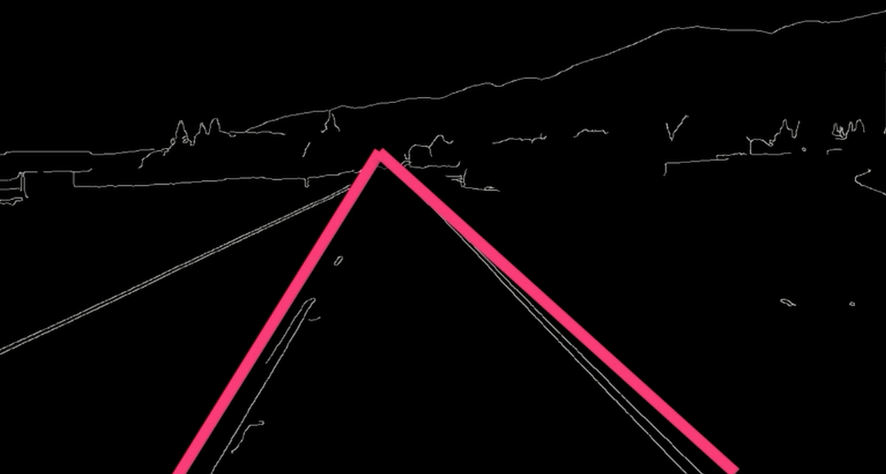

- `The region_of_intrest()` returns the enclosed region of our field of view, in which our region is triangular in shape
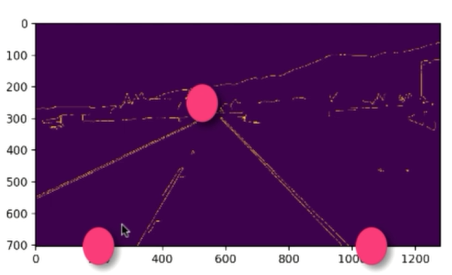
```
def region_of_intrest(image): 
    height = image.shape[0]
    polygons = np.array([
    [(200, height), (1100, height), (550, 250)]
    ])
    mask = np.zeros_like(image)
    cv2.fillPoly(mask, polygons, 255)
    return mask

```
- var `polygons` get the region of the intrest by giving the co-ordinates (x,y)
- var `mask` has matrix created by `np.zereos_lie(image)` which means it creates an array with complete zeros which has same shape of the image's corrosponding array. Both array will have the same no.of `rows` and `coloumns`, which means mask has the same amount of pixels and dimensions of our canny_image. [pixels of mask are completely black as the elements are completely zeros]
- Now, we have to fill the mask with the polygons with the help of openCV's `fillPolly()` function, the third argument represents the colour of our polygon  	
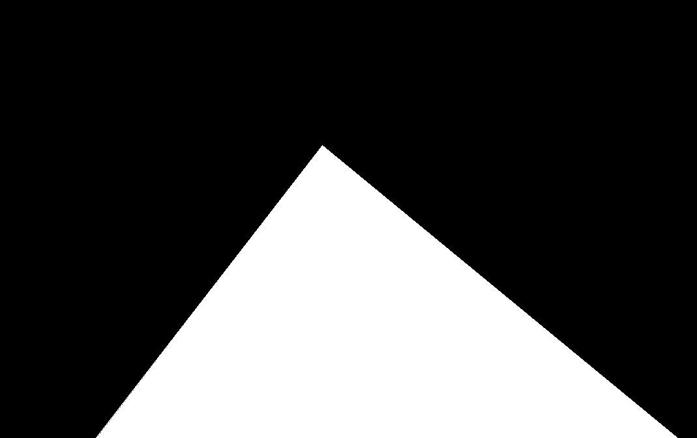

# Bitwise_and for isolating the lanes with Binarys
- If  you have already knew how Binary works with 0's and 1's then, it will be so intuitive
- As we masked the required portion of the image by fillPolly(), Now, we need are gonna isolate the lanes in the masked portion of the image.
- Inorder to do this, we are gonna completely use binaries to isolate.
- As an Array representation of the masked Image, you could find the `255` for white region and `0` for black region.
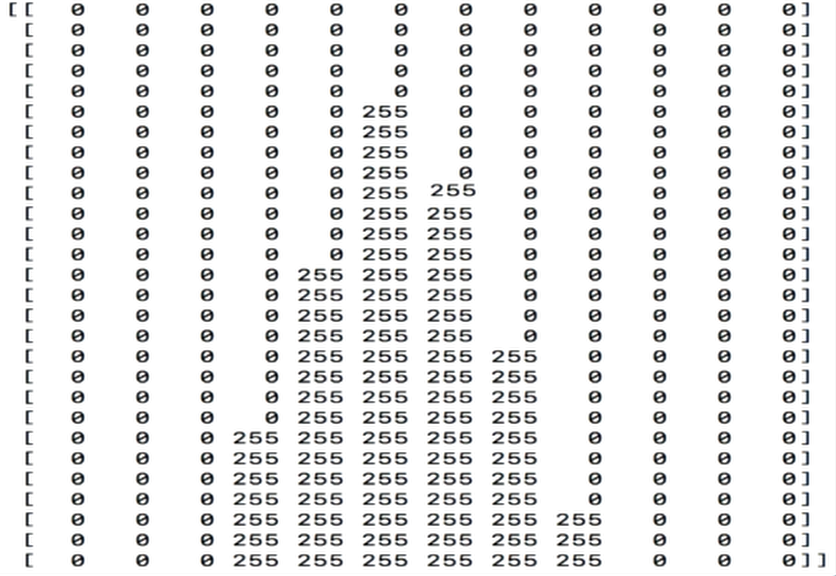
- Now, we are gonna turn this value in to Machine Understandable Binaries.
- Binary Representation
	- `255` - `11111111`
	- `0`   - `00000000`

- Now , we are going to make a AND rep b/w existing Img and gradient Img.
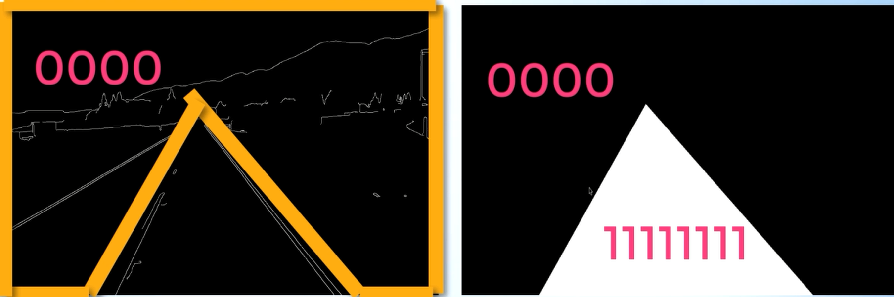
- For that we are gonna use the ```cv2.bitwise_and(image, mask)```

### After applying Bitwise_AND

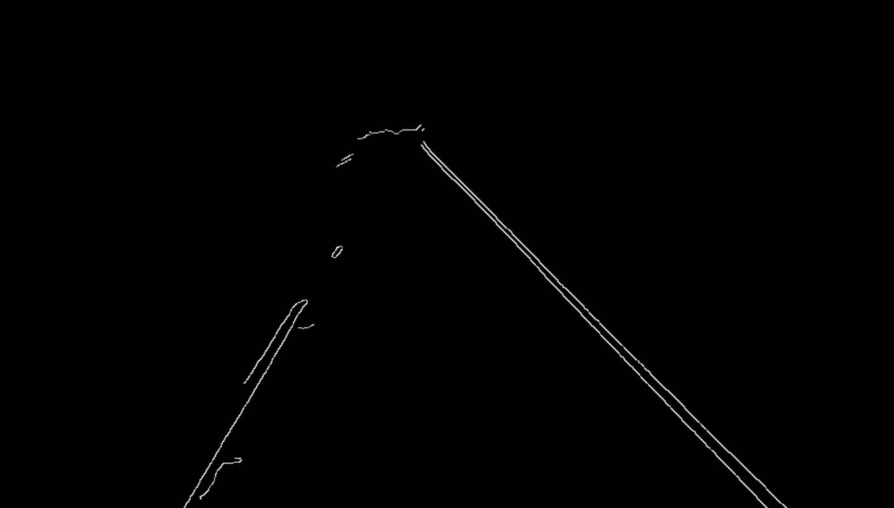
- Now, it's perfectly masked out the lanes on the Road.

# Hough Transform 
This technique helps to detect the stright lines in the image and helps indentifing Lane lines.
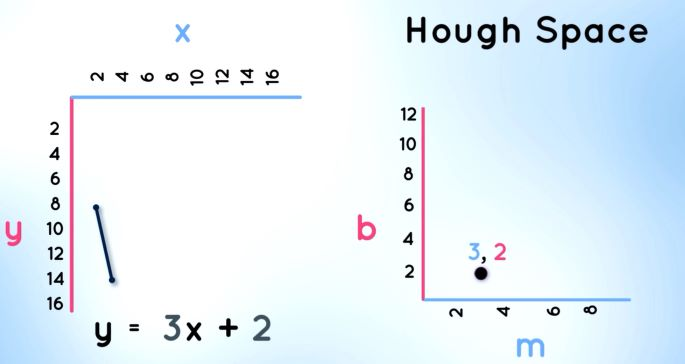
- As you could see the Hough space is the representation of the **b,m** axis in the Line equation **y=mx+b**
- so, the complete line in the space can be represented as a single point in the **Hough Space** </br>
Similarly, Imagine there's a single point in x,y axis and there are many possible lines that can pass through this dot, each line with different values of *m* and *b* 
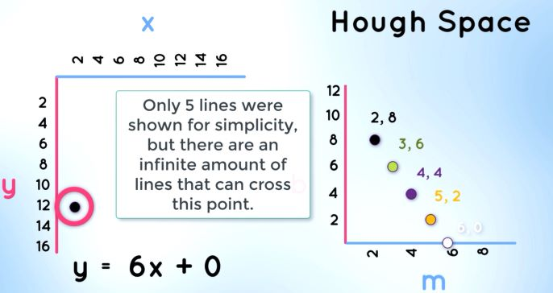
- Notice that a single point in (x,y) space is represented by a line in **Hough Space** </br>
What if we have two points in x,y plane.

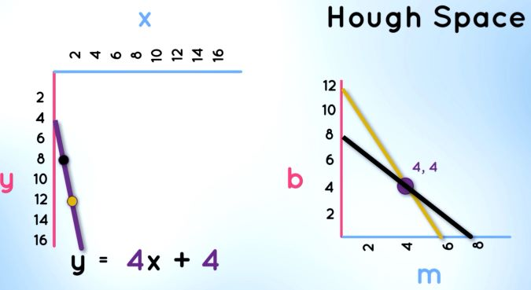

- There are many possible ways that each line can pass through the poits idividually, each line with differnt solpe and y-intersept values
- But, there is one point that is consistent with both the points 
- we can determine that by looking at the point of intersection in **Hough Sapce**, because that intersection points represents the *m*,*b* values of the lines 
- It happens in the same way if any other points comes in x,y plane and intersect in Hough space. </br>

why is this relevent? ,</br>

well, this idea of identifying possible lines from a series of points is how we are going to find lines in our gradient image 	
- we call the gradient image as just a series of white points, which represents edges in our **image Space (x,y) Plane**  </br>

Okay, let's take these four points in our Image space, and it corrosponds the following Hough Space, What we are gonna do is:
- First, split our Hough space in to a grid
- Each **Bin** inside our grid corrosponding to the slope and y-intersept value of a particular line 
- For example, what if I told you, these points belongs to a line, 
- well, all of these points intersection in Hough space are inside of a single bin 
- For every point of intersection we are going to cast the votes, inside of the bin that belongs to 
- The bin with the maximum number of votes, that's gonna be your line.
- whatever **m and b** value that **bin** belongs to that's the line we are going to draw. Since, it was voted as the line of best fit in discribing our data.

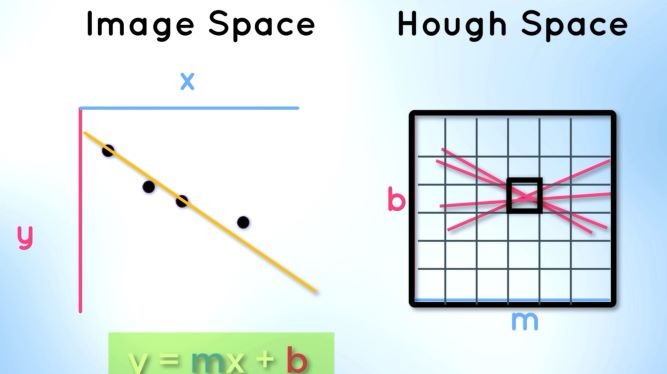

There's a one tiny problem, </br>
we still haven't taken into account of **vertical Lines** </br>
- Obviously, if you try to compute the slope of a vertial line the change in x is zero, which ultimatelu will always evaluate to a slope of infinity which is not something that we can represent.

- we need more robust representation of lines, so that we don't encounter any numeric problems.

- Clearly, in vertival stright line, **y=mx+c** dosen't fit and it cannot represents vertica lines.

- well, we can insted express it in the **polar** co-ordinates sstem **rho** and **theta**, such that our line equation can be  </br>
- ```ρ = xcos\theta + ysin\theta```
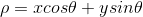
- The idea is the same. It's still the equation of line , but in polar coordinates.

- **ρ** is the perpendicular distance from origin to the drawn line.
- \theta indicates the angle of inclination of the normal line from the x-axis, which is measured in radians clockwise with rep to the positive x axis.

- The point of all being is that perviously a point in image space represented a line in hough space,
- Whereas now with polar coordinates for a given point by plotting the family of lines that go through it each or a distinct value for \theta and \rho we'll get a **sinusoidal Cureve**

 
</br>
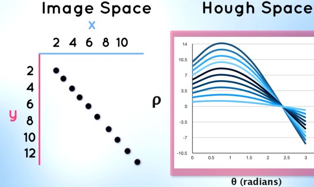 </br>

-This curve represents all of the different values for a \row and \theta of lines that pass through our point. </br>

This might look a bit intimidating but the concept is the exact same because imagine insted of one point, we ahve 10 points which in turn result in 10 sinusoidal curve

- So, this like befor a line can be detected by finding the nuber of intersection between curves the more curves intersecting means that the line represented by that intersection crosses more points.

- In our case, all ten of our curves intersect at a single point which means that there is a single line with some \rho and \theta value that corcess all ten of our dots.

- Now, we can apply the concept of voting that we discussed earlier such that our Hough space is still in the form of a grid.
 
- Obviously, a particualr bin will have a maximum number of votes and just like befor that bin and what the maixumun nubmer of votes that's going to be your line whatever theta in our vally that this bin belongs to that's the line that we draw </br>

Since, it was voted as the line of best fit in describing our data.

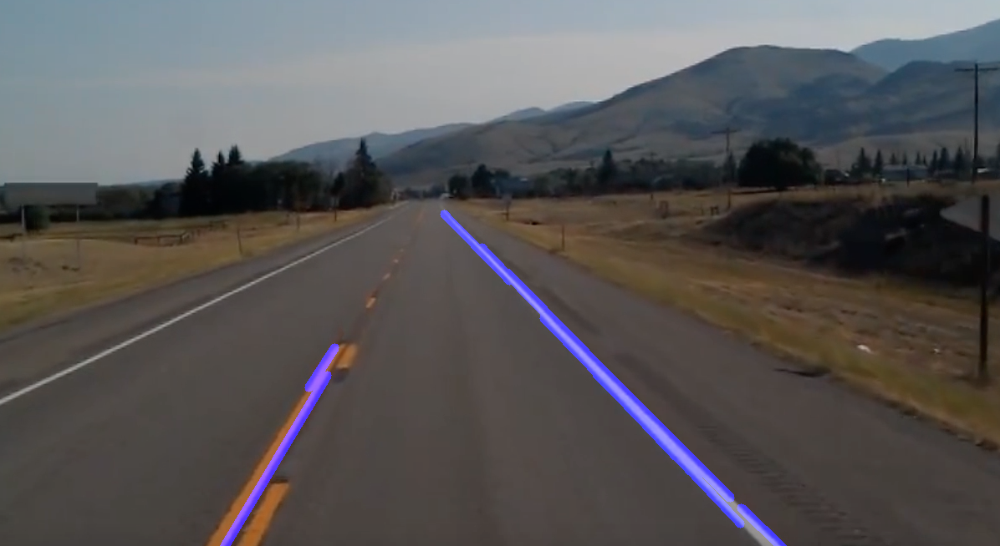 

