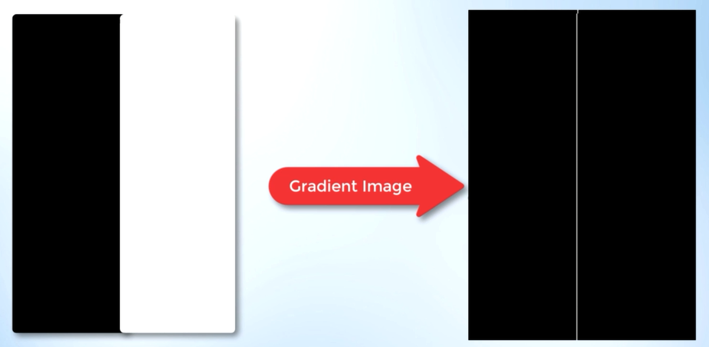
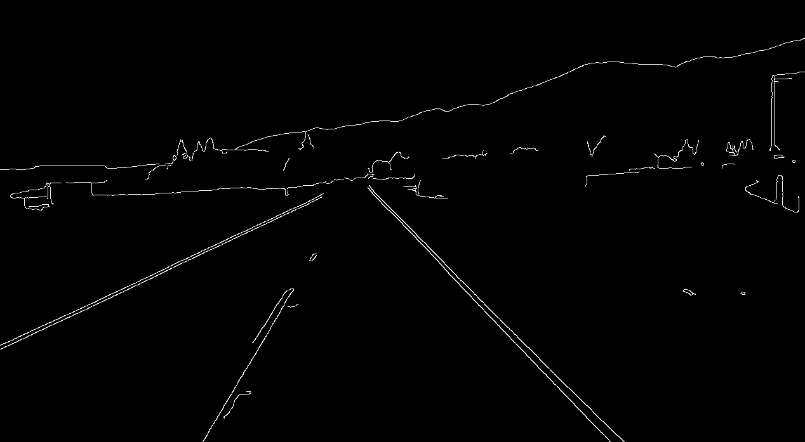

# lane-detection-openCV

```image = cv2.imread('test_image.jpg')``` </br>
#making a copy of image in array rep </br>
```lane_image = np.copy(image)```
# converting the image in to gray sclae for reducing the channels </br>
#gray scale images only has single channel, while RGB has three channesl </br>
```gray_image = cv2.cvtColor(lane_image,cv2.COLOR_RGB2GRAY)``` </br>

#we need to clear the noise in the image, because Image noise can create false noise </br>
#ultimately affects edge detection. </br>
#thats smooting the image. </br>
#filtering and smoothing the image can be done by guassian filter </br>

# To smooth the image </br>
#we can smooth by modifing the value of a pixel by average value of the </br>
#pixel intensities around the target pixel. </br>
#averaging out the pixels in the image to reduce noise is done by a kernal. </br>
```blur_image = cv2.GaussianBlur(gray_image, (5,5), 0)``` </br>
- But, when we apply a canny funtion we don't to apply GaussianBlur specially, </br>
- because cany funtion internally applies it. </br>

# applying Canny method to identify edges. </br>
- The change in brightness over a series of pixels is the GRADIENT. </br>
- A strong gradinent indicates a steep change and a small gradient indicates a shallow change </br> 
- To compute the gradient of a image one must recongnise, that we can represent an image in a two dimensional co-ordinate space [x,y]
- The X-axis represents the image's width and the y- axis go along the image's hight
- width represents the no.of columns and Hight represents the no.of rows, such that the product of width and the hight 
gives you the total number of pixels in the image.
- The point being not only we look our image as an array but also as a continious function of x and y, since it is a mathematical function we can perfome mathematical operation
- derivatives helps us to determine a rapid change in brightness of a image, **Canny** function perfomes a derivative on our function in both x and y directions.
- Therefore measuring the intensity with resp to the adjacent pixels 
- A small derivative is small change in intensity where as a big change in derivative is big change in intensity.
- By computing the derivatives in all directions of the image we are computing the **Gradient** , Since we call gradient as a change in intensity of pixels 
- so, when we call the **canny** function it does all for us, </br>
```cv2.Canny(image, low_threshold, high_ threshold)```

 </br>

- If the gradient is larger than the upper threshold then it is accepted as a edge pixel, if it is below the lower threshold then it is rejected , if the gradient is between the upper and lower thrrshold then it will accepted if it is conneted to a stronger threshold.
- recommended ratio **1:2** or **1:3**

- Gradients that exceed the `high_threshold` are traced as bright pixels, identifying the adjacent pixels in the image with the most rapid changes in brightness, small changes in brightness are not traced and accordingly they are black as they fall below the lower threshold 
- We used `Canny Method ` to outline the strongest gradient in our Image 	

# Identifying Lane lines in the image
### Region of Intrest()  
Before we detect. Firstly, we need to decide a particular lanes in the image that we should work-on to write the program. </br>
In my case it's as shown:


- `The region_of_intrest()` returns the enclosed region of our field of view, in which our region is triangular in shape

```
def region_of_intrest(image): 
    height = image.shape[0]
    polygons = np.array([
    [(200, height), (1100, height), (550, 250)]
    ])
    mask = np.zeros_like(image)
    cv2.fillPoly(mask, polygons, 255)
    return mask

```
- var `polygons` get the region of the intrest by giving the co-ordinates (x,y)
- var `mask` has matrix created by `np.zereos_lie(image)` which means it creates an array with complete zeros which has same shape of the image's corrosponding array. Both array will have the same no.of `rows` and `coloumns`, which means mask has the same amount of pixels and dimensions of our canny_image. [pixels of mask are completely black as the elements are completely zeros]
- Now, we have to fill the mask with the polygons with the help of openCV's `fillPolly()` function, the third argument represents the colour of our polygon  	


```cv2.imshow('result',blur_image)``` </br>
#waits for any keyPress to close. </br>
```cv2.waitKey(0)``` </br>
